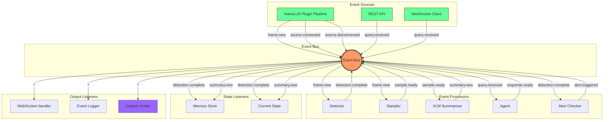
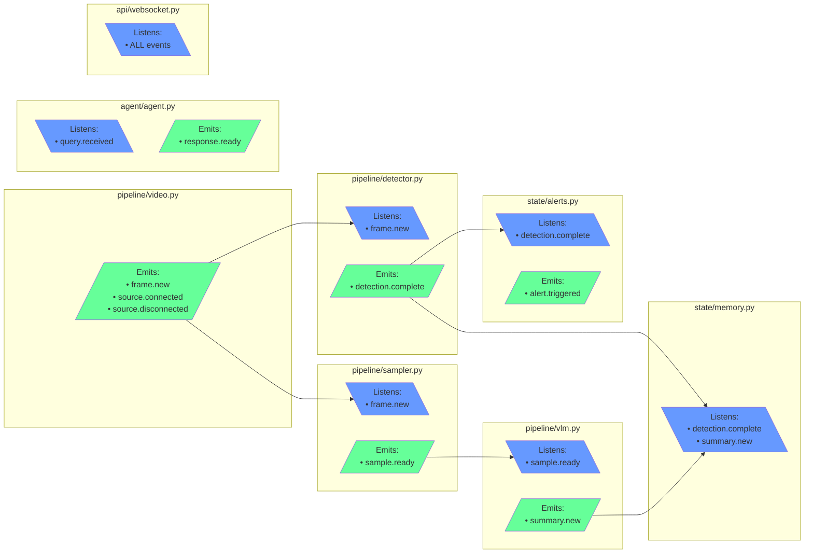

# AGILE Development Plan: Edge Vision MVP

## Overview

A focused backlog for building the Real-Time Video Intelligence MVP on NVIDIA Jetson, synthesized from NVIDIA documentation and our revised MVP spec.

**Product Goal:** Real-time video understanding with natural language interaction on edge hardware.

**Architecture Pattern:** Event-driven for modularity, reusability, and extensibility.

---

## Technology Stack (Validated)

| Component | Technology | Source |
|-----------|------------|--------|
| Base Container | `dustynv/nano_llm:r36.4.0` | [jetson-containers](https://github.com/dusty-nv/jetson-containers) |
| Video Pipeline | NanoLLM VideoSource (jetson-utils) | [NanoLLM Plugins](https://dusty-nv.github.io/NanoLLM/plugins.html) |
| VLM Inference | NanoLLM + VILA-7B AWQ | [NanoLLM](https://github.com/dusty-nv/NanoLLM) |
| Detection | Custom TensorRT Plugin (YOLOv8-s INT8) | [Ultralytics + TensorRT](https://docs.ultralytics.com/guides/nvidia-jetson/) |
| Pipeline Orchestration | NanoLLM Plugin Chain | [NanoLLM Plugins](https://dusty-nv.github.io/NanoLLM/plugins.html) |
| App-Level Events | Python asyncio EventBus | Lightweight, bridges to plugins |
| API Server | FastAPI + WebSocket | Standard Python |
| Frontend | React + Video.js | Standard Web |

> **Architecture Note:** Based on [feasibility analysis](./FEASIBILITY-ANALYSIS.md), we use NanoLLM's native plugin architecture for the inference pipeline, with our EventBus as an adapter for application-level events (alerts, queries, API).

---

## Event-Driven Architecture

### Core Principle

Components communicate through events, not direct calls. This enables:
- **Reusability** - Components work anywhere there's an EventBus
- **Extensibility** - Add hooks without modifying core code
- **Testability** - Emit mock events, verify handlers
- **Debuggability** - Log all events for replay/analysis

### Event Flow Architecture



### Event Lifecycle Sequence

```mermaid
sequenceDiagram
    autonumber
    participant DS as NanoLLM Pipeline
    participant BUS as Event Bus
    participant DET as Detector
    participant SAM as Sampler
    participant VLM as VLM Summarizer
    participant MEM as Memory
    participant ALT as Alert Checker
    participant WS as WebSocket
    participant UI as Frontend

    Note over DS,UI: Video Processing Flow

    DS->>BUS: emit(source.connected)
    BUS->>WS: forward(source.connected)
    WS->>UI: send(source.connected)

    loop Every Frame
        DS->>BUS: emit(frame.new)

        par Detection Path
            BUS->>DET: on(frame.new)
            DET->>DET: run YOLO inference
            DET->>BUS: emit(detection.complete)
            BUS->>MEM: on(detection.complete)
            BUS->>ALT: on(detection.complete)
            BUS->>WS: forward(detection.complete)
            WS->>UI: send(detections)
        and Sampling Path
            BUS->>SAM: on(frame.new)
            alt Every N seconds
                SAM->>BUS: emit(sample.ready)
                BUS->>VLM: on(sample.ready)
                VLM->>VLM: run VILA inference
                VLM->>BUS: emit(summary.new)
                BUS->>MEM: on(summary.new)
                BUS->>WS: forward(summary.new)
                WS->>UI: send(summary)
            end
        end

        opt Alert Condition Met
            ALT->>BUS: emit(alert.triggered)
            BUS->>WS: forward(alert.triggered)
            WS->>UI: send(alert)
        end
    end

    Note over DS,UI: User Query Flow

    UI->>WS: send(query)
    WS->>BUS: emit(query.received)
    BUS->>AGT: on(query.received)

    AGT->>AGT: classify intent
    AGT->>AGT: execute tool

    alt Tool: describe_now
        AGT->>VLM: describe(current_frame)
        VLM-->>AGT: description
    else Tool: count_objects
        AGT->>MEM: get_current_detections()
        MEM-->>AGT: detections
    else Tool: recent_summary
        AGT->>MEM: get_recent(time_window)
        MEM-->>AGT: summaries
    end

    AGT->>BUS: emit(response.ready)
    BUS->>WS: forward(response.ready)
    WS->>UI: send(answer)

    participant AGT as Agent
```

### Component Event Contract



### Standard Events

| Event | Payload | Emitted By | Typical Listeners |
|-------|---------|------------|-------------------|
| `frame.new` | frame, timestamp, frame_id | Video Pipeline | Detector, Sampler |
| `detection.complete` | detections, frame_id | Detector | AlertChecker, Memory, UI |
| `sample.ready` | frame, frame_id | Sampler | VLM Summarizer |
| `summary.new` | text, timestamp | VLM Summarizer | Memory, UI |
| `alert.triggered` | alert_id, condition, frame_id | AlertChecker | Notifier, UI, Logger |
| `query.received` | question, context, request_id | API | Agent |
| `response.ready` | answer, citations, request_id | Agent | API, UI |
| `source.connected` | url, resolution, fps | Pipeline | UI, Logger |
| `source.disconnected` | reason | Pipeline | UI, Reconnector |
| `error.occurred` | component, error, context | Any | Logger, UI |

---

## Epic 1: Container-First Development Environment

**Goal:** All code runs inside containers. No supported local execution path.

| ID | Story | Size | Acceptance Criteria |
|----|-------|------|---------------------|
| E1.1 | Set up base container from `dustynv/nano_llm` | S | Container runs on Jetson, GPU accessible |
| E1.2 | Create docker-compose.yml for development | S | `docker compose up` starts all services |
| E1.3 | Configure volume mounts for code hot-reload | S | Code changes reflect without rebuild |
| E1.4 | Set up model cache volume | S | Models persist across container restarts |
| E1.5 | Create Makefile wrapping all docker commands | M | `make run`, `make test`, `make shell` all exec inside container |
| E1.6 | Create .devcontainer for VS Code | S | VS Code Remote Containers works |
| E1.7 | Document container-first workflow in README | S | New developer can start in <30 min |
| E1.8 | Add container health check | S | Docker knows when app is ready |

**Container-First Principles:**
- **No local Python execution** - all code runs via `docker compose exec`
- **Same image dev → prod** - development container = production container + volume mounts
- **Makefile abstracts Docker** - developers run `make test`, not `docker compose exec...`
- **VS Code attaches to container** - IDE runs on host, execution in container

---

## Epic 2: Event Bus & Core Infrastructure

**Goal:** Establish event-driven foundation that bridges NanoLLM plugins with application logic.

| ID | Story | Size | Acceptance Criteria |
|----|-------|------|---------------------|
| E2.1 | Implement async EventBus class | M | Events emit, handlers fire asynchronously |
| E2.2 | Add `emit_sync()` for threaded contexts | S | NanoLLM plugin threads can emit events |
| E2.3 | Create typed Event dataclasses | S | All standard events have typed definitions |
| E2.4 | Implement handler registration decorators | S | `@bus.on("event.type")` decorator works |
| E2.5 | Add event logging middleware | S | All events logged with timestamps |
| E2.6 | Create event replay utility for debugging | M | Can replay logged events for testing |
| E2.7 | Create NanoLLM EventBusPlugin adapter | M | Bridges plugin outputs to EventBus |
| E2.8 | Write EventBus unit tests | M | Full test coverage of bus functionality |

**Technical Notes:**
- Use Python asyncio Queue for event processing
- Keep synchronous `emit_sync()` for NanoLLM plugin threads (they're threaded, not async)
- NanoLLM plugins have output channels → EventBusPlugin converts to our events
- Events are fire-and-forget; handlers shouldn't block

**Reference Implementation:**
```python
class EventBus:
    def on(self, event_type: str, handler: Callable): ...
    async def emit(self, event: Event): ...
    def emit_sync(self, event: Event): ...  # For threaded plugin contexts

class EventBusPlugin(Plugin):
    """Bridges NanoLLM plugin outputs to our EventBus."""
    def process(self, input, **kwargs):
        if isinstance(input, Detection):
            self.bus.emit_sync(Event("detection.complete", input))
        elif isinstance(input, str):
            self.bus.emit_sync(Event("summary.new", {"text": input}))
```

---

## Epic 3: Video Input Pipeline

**Goal:** Receive video from RTSP or USB camera using NanoLLM's VideoSource plugin.

| ID | Story | Size | Acceptance Criteria |
|----|-------|------|---------------------|
| E3.1 | Configure NanoLLM VideoSource for RTSP input | M | Connects to RTSP URL, decodes frames |
| E3.2 | Configure NanoLLM VideoSource for USB camera | M | Reads from /dev/video0, decodes frames |
| E3.3 | Connect VideoSource to EventBusPlugin | M | Frames flow through plugin chain to EventBus |
| E3.4 | Implement frame buffer for current frame access | S | Latest frame available via `get_current_frame()` |
| E3.5 | Emit `source.connected` on successful connect | S | Event includes resolution, fps |
| E3.6 | Emit `source.disconnected` on failure/disconnect | S | Event includes reason |
| E3.7 | Add pipeline health monitoring | S | Detect issues, emit `error.occurred` |
| E3.8 | Create config-based source switching | M | Switch RTSP↔USB via YAML config |

**Technical Notes:**
- NanoLLM VideoSource uses jetson-utils (hardware accelerated)
- Supports RTSP, V4L2 (USB/CSI), and video files
- Plugin runs in its own thread with queue-based processing
- Connect to downstream plugins: `video.add(detector)`, `video.add(sampler)`

**Reference:**
```python
from nano_llm.plugins import VideoSource

video = VideoSource(
    video_source="rtsp://camera:554/stream",  # or /dev/video0
    video_output=None  # We handle output via plugins
)
video.add(detector_plugin)
video.add(sampler_plugin)
```

---

## Epic 4: Object Detection Integration

**Goal:** Create custom NanoLLM plugin for YOLOv8 detection with TensorRT.

| ID | Story | Size | Acceptance Criteria |
|----|-------|------|---------------------|
| E4.1 | Export YOLOv8s to TensorRT INT8 engine | M | Engine file generated, loads on Jetson |
| E4.2 | Create YOLODetectorPlugin extending NanoLLM Plugin | M | Plugin processes frames, outputs detections |
| E4.3 | Implement TensorRT inference wrapper | M | Loads engine, runs inference, returns boxes |
| E4.4 | Connect detector to EventBusPlugin | S | Detections flow to EventBus |
| E4.5 | Implement Detection dataclass | S | Standardized format: class, confidence, bbox |
| E4.6 | Add confidence threshold configuration | S | Configurable via YAML |
| E4.7 | Benchmark detection latency | S | Measure and log inference time |

**Technical Notes:**
- Target <15ms per frame on AGX Orin per [benchmarks](https://wiki.seeedstudio.com/YOLOv8-TRT-Jetson/)
- Custom plugin follows NanoLLM Plugin pattern (threaded queue)
- INT8 calibration with COCO subset

**Reference:**
```python
from nano_llm import Plugin

class YOLODetectorPlugin(Plugin):
    def __init__(self, model_path, precision="int8", conf_threshold=0.5):
        super().__init__(outputs=['detections'])
        self.engine = TensorRTEngine(model_path, precision)
        self.threshold = conf_threshold

    def process(self, frame, **kwargs):
        detections = self.engine.detect(frame, self.threshold)
        self.output(detections)  # To connected plugins
```

---

## Epic 5: VLM Integration

**Goal:** Generate scene descriptions using NanoLLM's native VLM support.

| ID | Story | Size | Acceptance Criteria |
|----|-------|------|---------------------|
| E5.1 | Load VILA-7B AWQ model via NanoLLM | M | Model loads, responds to test prompt |
| E5.2 | Create VLM plugin wrapper for describe/query | M | `vlm.describe(frame)`, `vlm.query(frame, question)` |
| E5.3 | Create SamplerPlugin for frame decimation | M | Samples frames every N seconds |
| E5.4 | Create SummarizerPlugin using NanoLLM VLM | M | Runs VLM on sampled frames |
| E5.5 | Connect summarizer to EventBusPlugin | S | Summaries flow to EventBus |
| E5.6 | Add streaming response support | M | Use NanoLLM's StreamingResponse for tokens |
| E5.7 | Configure max tokens and temperature | S | Configurable via YAML |
| E5.8 | Handle VLM errors gracefully | S | Timeout, OOM don't crash app |

**Technical Notes:**
- NanoLLM already has optimized VLM inference (VILA, LLaVA)
- Use NanoLLM's ChatHistory for conversation management
- Sampler decouples frame rate from VLM rate (VLM is slower)
- VILA-7B AWQ fits in ~8GB, leaves headroom for detection

**Reference:**
```python
from nano_llm import NanoLLM, ChatHistory

model = NanoLLM.from_pretrained(
    "Efficient-Large-Model/VILA1.5-7b",
    quantization='awq'
)
chat = ChatHistory(model)

# In SummarizerPlugin.process():
response = model.generate(
    chat.embed_chat([frame, "Describe this scene."]),
    streaming=True
)
```

---

## Epic 6: Memory & State Management

**Goal:** Track recent activity by listening to events.

| ID | Story | Size | Acceptance Criteria |
|----|-------|------|---------------------|
| E6.1 | Implement CurrentState that updates on events | M | Subscribes to relevant events, maintains state |
| E6.2 | Implement RecentMemory with rolling window | M | Stores last N summaries, configurable window |
| E6.3 | Listen to `detection.complete` for history | S | Detection history queryable |
| E6.4 | Listen to `summary.new` for summary history | S | Summary history queryable |
| E6.5 | Implement `get_recent()` method | S | Returns summaries in time range |
| E6.6 | Add memory size limits to prevent OOM | S | Configurable max items, auto-evict oldest |

**Technical Notes:**
- Memory components are pure listeners - no direct coupling
- Use Python deque with maxlen for auto-eviction
- No database for MVP - in-memory only

---

## Epic 7: Agent & Tools

**Goal:** Natural language interface that responds to query events.

| ID | Story | Size | Acceptance Criteria |
|----|-------|------|---------------------|
| E7.1 | Create Agent class that listens to `query.received` | M | Agent handles incoming queries |
| E7.2 | Implement tool registry pattern | M | Tools register by name |
| E7.3 | Implement intent classification | M | Maps user query to tool |
| E7.4 | Implement `describe_now` tool | S | Returns VLM description of current frame |
| E7.5 | Implement `detect_objects` tool | S | Returns formatted detection list |
| E7.6 | Implement `count_objects` tool | S | Returns count of specified class |
| E7.7 | Implement `check_condition` tool | M | VLM answers yes/no with explanation |
| E7.8 | Implement `recent_summary` tool | M | Synthesizes recent activity from memory |
| E7.9 | Implement `set_alert` tool | M | Registers condition, emits confirmation |
| E7.10 | Implement `clear_alert` tool | S | Removes alert by ID |
| E7.11 | Emit `response.ready` with answer | S | Event includes answer, citations, request_id |
| E7.12 | Create tool response formatter | S | Consistent response structure |

**Technical Notes:**
- Agent subscribes to `query.received`, emits `response.ready`
- Tools access CurrentState and RecentMemory (injected)
- Consider NanoLLM's `bot_function` decorator for tool registration

---

## Epic 8: Alert System

**Goal:** Watch for conditions by listening to detection events.

| ID | Story | Size | Acceptance Criteria |
|----|-------|------|---------------------|
| E8.1 | Create Alert dataclass | S | Stores condition, timestamps, trigger count |
| E8.2 | Implement AlertManager | M | Add, remove, list alerts |
| E8.3 | Create AlertChecker that listens to `detection.complete` | M | Evaluates conditions on each detection |
| E8.4 | Integrate VLM for condition checking | M | Uses `check_condition` for complex conditions |
| E8.5 | Emit `alert.triggered` when condition met | S | Event includes alert_id, condition, evidence |
| E8.6 | Add cooldown to prevent spam | S | Configurable cooldown period |

**Technical Notes:**
- AlertChecker subscribes to `detection.complete`
- Simple conditions (object class) checked directly
- Complex conditions ("person not wearing helmet") use VLM

---

## Epic 9: REST API

**Goal:** HTTP endpoints that emit/listen to events.

| ID | Story | Size | Acceptance Criteria |
|----|-------|------|---------------------|
| E9.1 | Set up FastAPI application structure | S | App starts, serves /health |
| E9.2 | Implement `/health` endpoint | S | Returns status, GPU metrics |
| E9.3 | Implement `/status` endpoint (listen to state events) | S | Returns connection state, stats |
| E9.4 | Implement `/source/connect` endpoint | M | Triggers pipeline connect |
| E9.5 | Implement `/source/disconnect` endpoint | S | Triggers pipeline disconnect |
| E9.6 | Implement `/query` endpoint (emit `query.received`) | M | Emits event, waits for `response.ready` |
| E9.7 | Implement `/alerts` CRUD endpoints | M | GET, POST, DELETE for alerts |
| E9.8 | Add request validation with Pydantic | S | Invalid requests return 400 |
| E9.9 | Add structured error responses | S | Consistent error format |

**Technical Notes:**
- `/query` emits `query.received` and awaits `response.ready` with matching request_id
- Use FastAPI's async support
- Pydantic models for request/response

---

## Epic 10: WebSocket & Streaming

**Goal:** Stream events to client in real-time.

| ID | Story | Size | Acceptance Criteria |
|----|-------|------|---------------------|
| E10.1 | Set up WebSocket endpoint `/ws/live` | M | Client connects, stays connected |
| E10.2 | Create WebSocket handler that subscribes to events | M | Forwards events to connected clients |
| E10.3 | Forward `frame.new` as JPEG to client | M | Client receives frame updates |
| E10.4 | Forward `detection.complete` to client | S | Client receives detection JSON |
| E10.5 | Forward `summary.new` to client | S | Client receives new summaries |
| E10.6 | Forward `alert.triggered` to client | S | Client receives triggered alerts |
| E10.7 | Handle `query.received` from client via WebSocket | M | Query/response over same connection |
| E10.8 | Handle client disconnect gracefully | S | Unsubscribe handlers, no errors |
| E10.9 | Add frame rate limiting | S | Configurable max FPS to client |

**Technical Notes:**
- WebSocket handler is just another event listener
- Each client connection subscribes to relevant events
- Unsubscribe all handlers on disconnect

---

## Epic 11: Frontend UI

**Goal:** Single-page interface that displays events.

| ID | Story | Size | Acceptance Criteria |
|----|-------|------|---------------------|
| E11.1 | Set up React + Vite project | S | Dev server runs, builds production |
| E11.2 | Create WebSocket connection hook | M | Connects, reconnects on failure |
| E11.3 | Create event dispatcher in frontend | M | Routes incoming events to components |
| E11.4 | Implement VideoFeed component | M | Displays frames from `frame.new` events |
| E11.5 | Implement DetectionOverlay component | M | Draws boxes from `detection.complete` |
| E11.6 | Implement SummaryPanel component | S | Shows text from `summary.new` |
| E11.7 | Implement ChatInterface component | M | Sends queries, displays `response.ready` |
| E11.8 | Implement AlertPanel component | M | Shows `alert.triggered`, allows delete |
| E11.9 | Add connection status indicator | S | Shows connected/disconnected from events |
| E11.10 | Add source configuration modal | M | Enter RTSP URL or select USB |
| E11.11 | Style with Tailwind CSS | M | Clean, functional appearance |

**Technical Notes:**
- Frontend mirrors event-driven pattern
- Each component subscribes to relevant event types
- Centralized event dispatcher routes WebSocket messages

---

## Epic 12: Container Deployment

**Goal:** Production-ready container deployment. Same container dev → prod.

| ID | Story | Size | Acceptance Criteria |
|----|-------|------|---------------------|
| E12.1 | Create production Dockerfile (multi-stage) | M | Builds frontend, then backend in one image |
| E12.2 | Create production docker-compose.yml | S | Single command deployment, no volume mounts |
| E12.3 | Implement YAML configuration loading | S | Config from file + env overrides |
| E12.4 | Add structured JSON logging with events | S | Logs include event types, correlation IDs |
| E12.5 | Implement graceful shutdown (stop EventBus) | M | SIGTERM handled, bus stopped, resources cleaned |
| E12.6 | Create Jetson setup script (Docker + drivers only) | M | Provisions new device with Docker, nvidia-container-toolkit |
| E12.7 | Add health check to Dockerfile | S | Docker knows when app is healthy |
| E12.8 | Document deployment process | S | README covers container-only production setup |

**Technical Notes:**
- **Container-first:** Production = same image as dev, without volume mounts
- Graceful shutdown must stop EventBus and let handlers complete
- Multi-stage build: frontend → backend
- Model cache in named volume
- Jetson setup script only installs Docker + nvidia-container-toolkit, no Python

---

## Epic 13: Testing & Quality

**Goal:** Confidence in correctness and stability. All tests run in container.

| ID | Story | Size | Acceptance Criteria |
|----|-------|------|---------------------|
| E13.1 | Set up pytest infrastructure in container | S | `make test` runs pytest inside container |
| E13.2 | Write unit tests for EventBus | M | Emit, subscribe, unsubscribe tested |
| E13.3 | Write unit tests for Agent | M | Tool dispatch tested via events |
| E13.4 | Write unit tests for each tool | M | Each tool has tests |
| E13.5 | Write integration test for event flows | M | End-to-end event chains tested |
| E13.6 | Create mock event source for testing | M | Tests run without real camera |
| E13.7 | Add type hints throughout | M | mypy passes (run via `make typecheck`) |
| E13.8 | Add ruff linting | S | `make lint` passes |
| E13.9 | Create stability test (1hr run) | M | No crashes, no memory leak |

**Technical Notes:**
- **All tests run inside container** via `make test`
- Event-driven architecture makes testing easier
- Mock events instead of mocking dependencies
- Event replay utility (E2.6) useful for integration tests

---

## Backlog Summary

| Epic | Stories | S | M | L |
|------|---------|---|---|---|
| 1. Container-First Dev | 8 | 7 | 1 | 0 |
| 2. Event Bus | 8 | 4 | 4 | 0 |
| 3. Video Pipeline | 8 | 4 | 4 | 0 |
| 4. Detection | 7 | 4 | 3 | 0 |
| 5. VLM | 8 | 3 | 5 | 0 |
| 6. Memory/State | 6 | 4 | 2 | 0 |
| 7. Agent & Tools | 12 | 5 | 7 | 0 |
| 8. Alerts | 6 | 3 | 3 | 0 |
| 9. REST API | 9 | 5 | 4 | 0 |
| 10. WebSocket | 9 | 4 | 5 | 0 |
| 11. Frontend | 11 | 3 | 8 | 0 |
| 12. Deployment | 8 | 4 | 4 | 0 |
| 13. Testing | 9 | 3 | 6 | 0 |
| **Total** | **109** | **53** | **56** | **0** |

---

## Recommended Sprint Structure

### Sprint 1: Container Foundation & Event Bus
- Epic 1 (Container-First Dev) - All
- Epic 2 (Event Bus) - All

**Demo:** `make dev` starts container, `make test` runs EventBus tests inside container.

### Sprint 2: Video & Detection Pipeline
- Epic 3 (Video Pipeline) - All
- Epic 4 (Detection) - All

**Demo:** Live video with `frame.new` and `detection.complete` events printing.

### Sprint 3: Intelligence
- Epic 5 (VLM) - All
- Epic 6 (Memory) - All

**Demo:** `summary.new` events printing, memory queryable.

### Sprint 4: Interaction
- Epic 7 (Agent) - All
- Epic 8 (Alerts) - All
- Epic 9 (REST API) - All

**Demo:** Query via curl (`query.received` → `response.ready`). Alerts trigger.

### Sprint 5: Interface
- Epic 10 (WebSocket) - All
- Epic 11 (Frontend) - All

**Demo:** Full UI with live video, chat, alerts - all event-driven.

### Sprint 6: Production
- Epic 12 (Deployment) - All
- Epic 13 (Testing) - All

**Demo:** Deploy to fresh Jetson, run stability test, verify event logging.

---

## Definition of Done

A story is complete when:

1. **Code** - Implementation complete and merged
2. **Container** - Works inside container (`make dev` + `make test` pass)
3. **Events** - Emits/listens to correct events per spec
4. **Tests** - Unit/integration tests pass (via `make test`)
5. **Docs** - Code documented, README updated if needed
6. **Review** - Code reviewed (or self-reviewed for solo dev)
7. **Works on Jetson** - Tested on actual hardware (in container)

---

## Adding Custom Hooks

The event-driven architecture makes extension easy:

```python
# my_custom_hook.py
from src.core.events import bus, Event

class ObjectCounter:
    """Example: Count objects over time."""

    def __init__(self):
        # Just subscribe to the events you care about
        bus.on("detection.complete", self.on_detection)
        self.counts = {}

    async def on_detection(self, event: Event):
        for det in event.data["detections"]:
            cls = det.class_name
            self.counts[cls] = self.counts.get(cls, 0) + 1

        # Emit your own events
        if sum(self.counts.values()) % 100 == 0:
            await bus.emit(Event(
                type="stats.object_counts",
                data={"counts": self.counts}
            ))

# To activate: just instantiate
counter = ObjectCounter()
```

No changes to core code required.

---

## Technical Risks & Mitigations

| Risk | Likelihood | Impact | Mitigation |
|------|------------|--------|------------|
| Event bus becomes bottleneck | Low | High | Profile, add backpressure if needed |
| NanoLLM threaded plugin → async EventBus bridging | Medium | Medium | `emit_sync()` with `call_soon_threadsafe`, test early |
| Custom YOLOv8 TensorRT plugin complexity | Medium | Medium | Follow NanoLLM Plugin pattern, reference examples |
| Event ordering issues | Low | Medium | Add sequence numbers if needed |
| VLM latency too high | Low | Medium | VILA-3B fallback available |
| Memory pressure with all models loaded | Medium | High | Profile memory, tune batch sizes |
| Handler exceptions break event flow | Medium | Medium | Try/catch in bus, log errors |
| NanoLLM API changes | Low | Medium | Pin version, monitor releases |

---

## Dependencies

```
Sprint 1 ──► Sprint 2 ──► Sprint 3 ──► Sprint 4 ──► Sprint 5 ──► Sprint 6
   │            │            │            │            │
   │            │            │            │            └── Needs WebSocket
   │            │            │            └── Needs VLM + Memory
   │            │            └── Needs Detection events
   │            └── Needs EventBus working
   └── Needs Dev Environment
```

Event Bus (Epic 2) is foundational - all other components depend on it.

---

## Project Structure (Updated)

```
edge-vision/
├── src/
│   ├── main.py                 # App entry, starts EventBus
│   ├── config.py
│   │
│   ├── core/
│   │   ├── events.py           # EventBus, Event dataclass
│   │   ├── event_types.py      # Typed event definitions
│   │   └── logging.py          # Event-aware logging
│   │
│   ├── pipeline/
│   │   ├── video.py            # Emits: frame.new, source.*
│   │   ├── detector.py         # Listens: frame.new → Emits: detection.complete
│   │   ├── sampler.py          # Listens: frame.new → Emits: sample.ready
│   │   └── vlm.py              # Listens: sample.ready → Emits: summary.new
│   │
│   ├── agent/
│   │   ├── agent.py            # Listens: query.received → Emits: response.ready
│   │   ├── tools.py
│   │   └── intents.py
│   │
│   ├── state/
│   │   ├── current.py          # Listens: detection.complete, summary.new
│   │   ├── memory.py           # Listens: detection.complete, summary.new
│   │   └── alerts.py           # Listens: detection.complete → Emits: alert.triggered
│   │
│   ├── api/
│   │   ├── routes.py           # Emits: query.received
│   │   └── websocket.py        # Listens: *, forwards to clients
│   │
│   └── hooks/                  # Custom extensions
│       └── example_counter.py
│
├── frontend/
│   └── src/
│       ├── events/             # Frontend event dispatcher
│       └── components/         # Event-driven components
│
└── tests/
    ├── test_events.py          # EventBus tests
    ├── test_integration.py     # Event flow tests
    └── fixtures/
        └── mock_events.py      # Mock event generators
```

---

## References

- [NanoLLM Documentation](https://dusty-nv.github.io/NanoLLM/)
- [NanoLLM GitHub](https://github.com/dusty-nv/NanoLLM)
- [jetson-containers](https://github.com/dusty-nv/jetson-containers)
- [DeepStream Python Apps](https://github.com/NVIDIA-AI-IOT/deepstream_python_apps)
- [DeepStream Documentation](https://docs.nvidia.com/metropolis/deepstream/dev-guide/)
- [Jetson Platform Services](https://docs.nvidia.com/jetson/jps/)
- [YOLOv8 on Jetson](https://docs.ultralytics.com/guides/nvidia-jetson/)
- [NVIDIA Jetson AI Lab](https://www.jetson-ai-lab.com/)

---

*AGILE Development Plan (Event-Driven) - January 2026*
